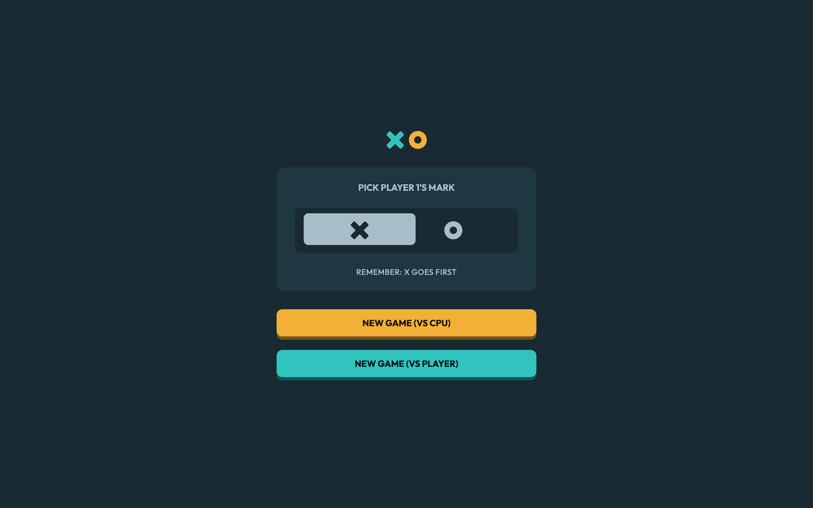
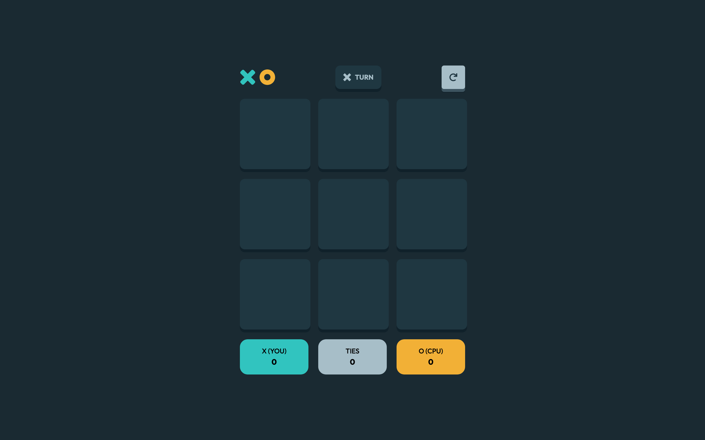
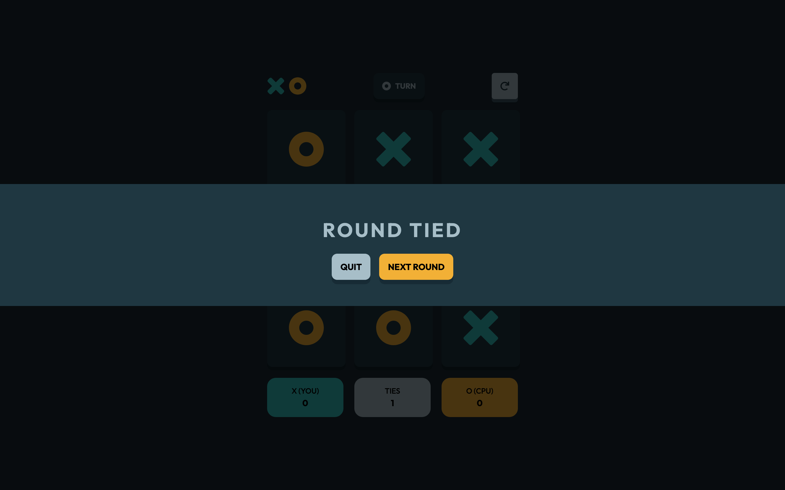

# Frontend Mentor - Tic Tac Toe solution

This is a solution to the [Tic Tac Toe challenge on Frontend Mentor](https://www.frontendmentor.io/challenges/tic-tac-toe-game-Re7ZF_E2v). Frontend Mentor challenges help you improve your coding skills by building realistic projects. 

## Table of contents

- [Overview](#overview)
  - [The challenge](#the-challenge)
  - [Screenshot](#screenshots)
  - [Links](#links)
- [My process](#my-process)
  - [Built with](#built-with)
  - [What I learned](#what-i-learned)
  - [Useful resources](#useful-resources)
- [Author](#author)

## Overview

### The challenge

Users should be able to:

- View the optimal layout for the game depending on their device's screen size
- See hover states for all interactive elements on the page
- Play the game either solo vs the computer or multiplayer against another person
- **Bonus 1**: Save the game state in the browser so that it’s preserved if the player refreshes their browser
- **Bonus 2**: Instead of having the computer randomly make their moves, try making it clever so it’s proactive in blocking your moves and trying to win

### Screenshots





### Links

- Solution URL: [Add solution URL here](https://github.com/KatherineEbel/fem-tic-tac-toe)

[//]: # (- Live Site URL: [Add live site URL here]&#40;https://your-live-site-url.com&#41;)

## My process

### Built with

- Semantic HTML5 markup
- CSS custom properties
- Flexbox
- CSS Grid
- [React](https://reactjs.org/) - JS library (v19.0.0)
- [Tailwind CSS](https://tailwindcss.com/) - CSS framework (v3.4.17)
- [TypeScript](https://www.typescriptlang.org/) - Typed JavaScript (v5.6.2)
- [Vite](https://vitejs.dev/) - Frontend build tool (v6.0.5)
- [Radix UI](https://www.radix-ui.com/) - Accessible UI components
- [clsx](https://github.com/lukeed/clsx) - Utility for conditional class names
- [class-variance-authority](https://github.com/joe-bell/cva) - For managing conditional styles
- [Prettier](https://prettier.io/) - Code formatting

### What I learned

While working through this project, I gained a deeper understanding of managing state in a React application,
particularly how to handle complex states for game logic. I also improved my skills in writing reusable components and
organizing a project structure using best practices. Below are some specific examples:

```js
// Handling game logic for determining the winner
const calculateWinner = (squares) => {
  const lines = [
    [0, 1, 2],
    [3, 4, 5],
    [6, 7, 8],
    [0, 3, 6],
    [1, 4, 7],
    [2, 5, 8],
    [0, 4, 8],
    [2, 4, 6],
  ];
  for (let i = 0; i < lines.length; i++) {
    const [a, b, c] = lines[i];
    if (squares[a] && squares[a] === squares[b] && squares[a] === squares[c]) {
      return squares[a];
    }
  }
  return null;
};
```

Additionally, I learned how to implement responsive designs using Tailwind CSS, ensuring the game layout adapts well
across various devices.

```jsx
/* Example of a responsive Tailwind class for styles */
<>
  <div className="mx-auto my-auto flex w-full max-w-[328px] flex-col gap-y-5 sm:max-w-[460px]">
    <GameMenu />
    <Game />
  </div>
  {modalProps ? <GameModal {...modalProps} /> : null}
</>
```

Furthermore, I explored managing conditional styles efficiently with `clsx` and `class-variance-authority`, which
simplified the code and enhanced maintainability.

```js
import { cva } from 'class-variance-authority';

const buttonStyles = cva('px-4 py-2 font-bold', {
  variants: {
    intent: {
      primary: 'bg-blue-500 text-white',
      secondary: 'bg-gray-300 text-black',
    },
  },
  defaultVariants: {
    intent: 'primary',
  },
});

<button className={buttonStyles({ intent: 'secondary' })}>Click Me</button>;
```

This project was also a great opportunity to deepen my TypeScript knowledge, particularly in defining precise types and
interfaces for components, function parameters, and game logic.

```typescript
interface SquareProps {
  value: 'X' | 'O' | null;
  onClick: () => void;
}
```

### Useful resources

- [MDN Web Docs - Responsive Design](https://developer.mozilla.org/en-US/docs/Learn/CSS/CSS_layout/Responsive_Design) -
  This is an excellent resource for understanding responsive design principles and best practices.
- [Tailwind CSS Documentation](https://tailwindcss.com/docs) - The official Tailwind CSS documentation is incredibly
  helpful for learning how to use the framework effectively.
- [React Documentation](https://reactjs.org/docs/getting-started.html) - The official React documentation is a great
  place to understand the core concepts and advanced techniques.
- [Radix UI Primitives](https://www.radix-ui.com/docs/primitives/overview/introduction) - This resource provides
  in-depth guidance on using accessible UI components with Radix UI.
- [TypeScript Handbook](https://www.typescriptlang.org/docs/handbook/intro.html) - A great resource for learning and
  referencing TypeScript features.
- [Frontend Mentor Community](https://www.frontendmentor.io/community) - A helpful community for sharing solutions,
  receiving feedback, and improving coding skills.

## Author

- Frontend Mentor - [@KatherineEbel](https://www.frontendmentor.io/profile/KatherineEbel)
